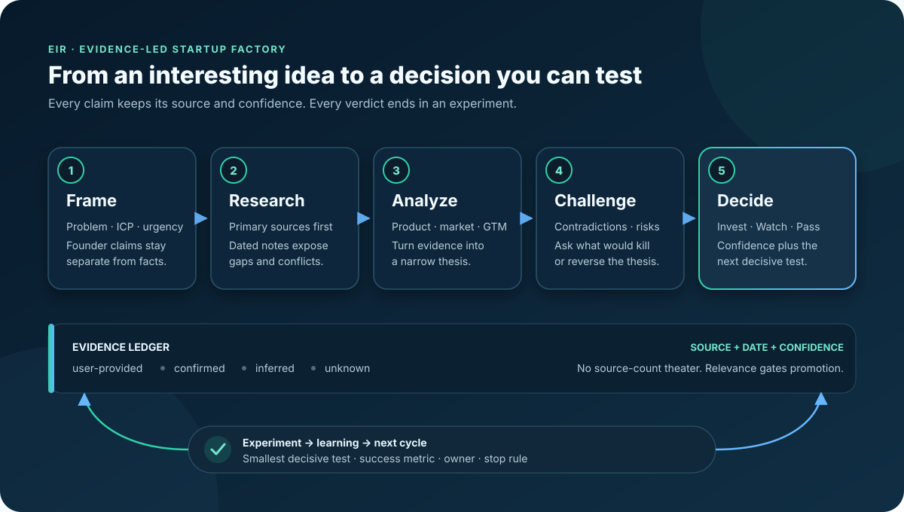

# EIR

**Turn an early startup idea into an evidence-backed decision and a concrete plan to test it.**

EIR is an open, local-first diligence workflow for founders, investors, venture studios, and product teams. Start with a rough opportunity brief. EIR guides a human or AI runner through problem framing, research planning, claim verification, contradiction testing, product and go-to-market analysis, a calibrated <code>Invest / Watch / Pass</code> verdict, and experiments with success and stop conditions.

It does not hide the work behind a score. Each case is a folder of inspectable artifacts: the original intake, research request, claim ledger, diligence memo, scorecard, experiment plan, morning brief, and case manifest. Founder claims remain separate from <code>confirmed</code> evidence, <code>inferred</code> reasoning, and <code>unknown</code> gaps.

*The diagram groups the detailed eight-stage workflow into five macro phases. The canonical operating sequence appears below.*

| Method | Role model | Teaching archive | Artifact examples |
|---|---|---|---|
| **8 connected stages** from intake to reviewed learning | **EIR + 3 specialist roles** with one final owner | **8 sanitized research runs + 113 source records** | **8 reusable templates** plus memo, JSON, HTML, document, and deck examples |

**Repository inventory:** 8 templates · 7 field guides · 49 example files · 8 research-run records · 113 unique source records · 3 specialist roles

[Start a case](#start-a-case) · [See the full pipeline](#the-eight-stage-factory) · [Tour the learning library](#a-practical-curriculum) · [Open worked examples](#worked-examples) · [Understand the runtime boundary](#what-eir-supplies-and-what-you-supply)

## See the result before the process

The recommended first example is **DenialPilot**, a fictional AI denial-recovery product for specialty clinics.

| From a rough idea | To a reviewable decision |
|---|---|
| “Use AI to automate denied-claim appeals.” | Narrow the wedge to specialty-clinic denial recovery with measurable ROI inside 60 days. |
| Broad healthcare automation story | Named buyers, workflow, substitutes, incumbents, implementation burden, and moat hypothesis |
| Attractive market narrative | <code>Watch</code> at <code>Low</code> confidence because the pain is real but the market is crowded and delivery may become services-heavy |
| “Build more product” | Run a focused specialty pilot, test pricing, and compare a channel partnership with founder-led sales |

This is not a claim that the fictional startup should be funded. It is a demonstration of how EIR turns a vague thesis into a falsifiable judgment, exposes the evidence gaps, and names the next proof required.

[Read the full fictional memo](examples/diligence/2026-03-10_denialpilot-diligence-memo.md) · [Read the executive morning brief](examples/briefs/2026-03-10_denialpilot-morning-brief.txt)

## Why the artifact trail matters

A prompt can produce polished prose. EIR is designed to produce a traceable decision process.

| A one-off analysis often... | EIR requires... |
|---|---|
| Blends founder statements with outside facts | A preserved intake and explicit claim labels |
| Collects links without proving claims | Opened, relevant sources connected to consequential claims |
| Lists competitors but ignores substitutes | Competitors, internal workflows, services, and adjacent alternatives |
| Optimizes for a persuasive answer | A skeptic pass, contradictions, kill questions, and lower confidence when evidence is weak |
| Ends with generic recommendations | Experiments with measurable success and stop conditions |
| Loses what was learned after delivery | A reviewed choice to promote reusable learning or keep it case-local |
| Repeats research for every format | One reviewed evidence model that can feed a memo, scorecard, brief, report, or deck |

The result is not certainty. It is a better record of what is known, what is inferred, what remains unknown, and what should happen next.

## Start a case

### 1. Clone and scaffold

Requirements: Git and Python 3.10 or newer. The three utilities under <code>scripts/</code> use only the Python standard library.

~~~bash
git clone https://github.com/Pourias/EIR.git
cd EIR
python3 scripts/new_case.py "Your startup idea"
~~~

The command **creates a Git-ignored local working folder; it does not browse, run a model, or perform diligence**. It produces:

~~~text
work/YYYY-MM-DD_your-startup-idea/
├── idea-intake.md
├── research-request.json
├── claim-ledger.md
├── diligence-memo.md
├── go-no-go-scorecard.json
├── experiment-plan.md
├── morning-brief.txt
└── case-manifest.json
~~~

The <code>work/</code> directory is ignored by Git, which helps prevent accidental commits. This is not an access-control boundary; protect sensitive data according to your environment.

You can also use:

~~~bash
make new-case IDEA="Your startup idea"
~~~

### 2. Supply the minimum useful input

Complete the intake with:

1. the decision you are trying to make;
2. the problem and people who experience it;
3. the proposed product or service;
4. geography, industry, and time horizon;
5. constraints, safety concerns, and forbidden approaches;
6. facts supplied by the founder, clearly marked as unverified;
7. the unknowns most likely to reverse the decision.

If you do not know an answer, write <code>unknown</code>. EIR is built to expose missing evidence, not reward invented completeness.

### 3. Choose an execution mode

| Mode | What you do | What EIR contributes |
|---|---|---|
| **Manual** | Conduct interviews and research yourself | Templates, evidence labels, challenge method, scorecard, and review gates |
| **Single agent** | Give one capable AI runner the case and access to research tools | The operating contract, full sequence, artifact shapes, and evaluation rules |
| **Multi-agent** | Route bounded work to Scout, Analyst, and Skeptic | Clear ownership, bounded role briefs and deliverables, and one EIR integrator responsible for the verdict |

No particular agent platform is required. If current facts matter, your chosen runner must be able to open sources, preserve citations, and report access failures.

### 4. Run the case

Give the runner [<code>AGENTS.md</code>](AGENTS.md), [<code>SOUL.md</code>](SOUL.md), [<code>TOOLS.md</code>](TOOLS.md), the completed intake, and the research request. A useful starting instruction is:

> Run the EIR workflow on this case. Preserve founder statements as user-provided. Use current, primary sources for changing claims; record consequential claims in the ledger; show contradictions and failed source access; separate confirmed evidence, inference, and unknowns; return an Invest, Watch, or Pass view with calibrated confidence; and design the smallest experiments that could confirm or reverse the verdict. Do not invent missing traction, team, pricing, or customer facts.

### 5. Review and validate

Before accepting the result, inspect the sources, reasoning, contradiction pass, verdict, and experiment thresholds. Before publishing repository changes, run:

~~~bash
python3 scripts/validate_repository.py
git diff --check
~~~

The validator checks repository structure, local Markdown links, JSON, SVG/XML, unsafe local paths, common secret patterns, forbidden local artifacts, and file-size limits. It does not parse or render Mermaid. It also cannot judge whether a claim is true, a source is relevant, a binary file is safe to publish, or you have redistribution rights. Those remain human review responsibilities. Inspect every diagram and generated artifact on GitHub before release.

Setup takes minutes. Serious diligence takes as long as the evidence requires, and live research may use paid tools supplied by your runtime.

## The eight-stage factory

EIR uses one canonical operating sequence:

~~~mermaid
flowchart LR
    I["1. Intake"] --> F["2. Frame"]
    F --> R["3. Route"]
    R --> G["4. Gather"]
    G --> A["5. Analyze"]
    A --> C["6. Challenge"]
    C --> D["7. Decide"]
    D --> H{"Human review"}
    H -->|reusable| P["8. Promote"]
    H -->|case-specific| Q["Keep with case"]
    X["Your live research tools"] -.-> G
    D --> O["Memo · scorecard · brief · report · deck"]
    P --> L["Reusable library metadata"]
~~~

| Stage | Work performed | Primary artifact | Gate before moving on |
|---|---|---|---|
| **1. Intake** | Preserve the requester's words, target user, geography, constraints, and desired decision. | [Idea intake](templates/idea-intake.md) | Founder statements are labeled <code>user-provided</code>, not treated as proof. |
| **2. Frame** | Convert the idea into a problem, ICP, wedge, moat hypothesis, risks, and decision-changing unknowns. | Testable thesis and question set | The decision is specific enough that evidence could change it. |
| **3. Route** | Write the research contract and choose current, market, competitor, regulatory, technical, or paper-forward lanes. | [Research request](templates/research-request.json) | Freshness, source expectations, exclusions, depth, and stopping rules are explicit. |
| **4. Gather** | Discover sources, open them, date them, classify them, record access failures, and connect them to claims. | [Source cards](templates/source-card.md) and [claim ledger](templates/claim-ledger.md) | Search snippets and automated scores are not used as evidence. |
| **5. Analyze** | Test the product, buyer, alternatives, economics, distribution path, market shape, and defensibility. | [Diligence memo](templates/startup-diligence-memo.md) | Facts, inference, and unsupported assumptions remain visibly separate. |
| **6. Challenge** | Seek contrary evidence, substitution risk, adoption friction, hidden service labor, regulatory blockers, and failure modes. | Contradiction records and kill questions | The attractive story survives a documented skeptic pass, or confidence falls. |
| **7. Decide** | Issue <code>Invest</code>, <code>Watch</code>, or <code>Pass</code>; calibrate confidence; identify the cheapest decisive tests. | [Scorecard](templates/go-no-go-scorecard.json) and [experiment plan](templates/experiment-plan.md) | Each test has an owner, measurable success condition, and stop condition. |
| **8. Promote** | Review claims, privacy, rights, usefulness, and artifact quality; retain learning in the correct place. | Reviewed memo, brief, report, deck, or library metadata | Reusable learning is promoted only when it is non-sensitive, supportable, and useful beyond the case. |

The final analysis assembled across stages 2 through 7 follows a consistent decision spine:

~~~text
Problem → ICP → Wedge → Moat → GTM → Risks → Next experiments
~~~

That spine is the structure of the judgment, not a second pipeline.

Read [How the factory works](docs/HOW_IT_WORKS.md) for the complete conceptual model and historical artifact lifecycle.

## A detailed operating runbook

A serious case usually follows these steps:

<strong>Open the complete 19-step runbook</strong>

1. **Open a local case.** Scaffold the Git-ignored folder and confirm the storage location is appropriate for its sensitivity.
2. **Freeze the original brief.** Preserve exactly what the founder or requester supplied before analysis changes the wording.
3. **Name the decision.** Decide whether the output supports investment, incubation, partnership, product planning, or another explicit choice.
4. **Split the input.** Mark facts, assumptions, preferences, constraints, and unknowns separately.
5. **Write reversal questions.** Identify what evidence would make the team change its mind.
6. **Set the research contract.** Define geography, factual cutoff, source classes, citation standard, excluded tools, depth, and stop conditions.
7. **Route evidence lanes.** Use only the lanes the decision needs: current intelligence, competitors, customer signals, regulation, technical feasibility, papers, or economics.
8. **Discover, then open.** Treat search results as leads. Read the underlying source before it supports a claim.
9. **Build source cards and a claim ledger.** Record title, URL, publisher, date, access status, relevance, supported claim, and limitations.
10. **Close gaps iteratively.** Expand entities and terms, target missing evidence, check contradictions, and stop when further retrieval is unlikely to change the next action.
11. **Analyze the business.** Evaluate pain, ICP, buyer, workflow, substitutes, wedge, moat, market, business model, unit economics, distribution, and implementation burden.
12. **Run the skeptic pass.** Search for disconfirming evidence, incumbent responses, regulatory blockers, weak willingness to pay, dependency risk, and services disguised as software.
13. **Resolve disagreements.** Explain whether conflicting evidence differs by date, geography, definition, sample, incentive, or method. Carry unresolved conflicts forward.
14. **Make the verdict falsifiable.** State the decision, confidence, strongest support, strongest objection, and facts that could reverse it.
15. **Design decisive experiments.** Assign metrics, success thresholds, stop conditions, sequencing, and evidence to capture.
16. **Create the required formats.** Derive the memo, scorecard, brief, report, or presentation from the same reviewed evidence model.
17. **Review as a human.** Check claim grounding, freshness, privacy, security, rights, generated-document rendering, and whether the output answers the original decision.
18. **Retain learning deliberately.** Promote only reusable, reviewed metadata or patterns. Keep confidential and case-specific material with the case.
19. **Validate before publication.** Run the repository checks, inspect every changed file, and re-open rendered artifacts.

This sequence can be shortened for a lightweight case, but the evidence boundaries should not be removed.

## Agent architecture and accountability

EIR can run sequentially as one role. When parallel agents are available, it separates discovery, commercial synthesis, and challenge work without splitting final accountability.

~~~mermaid
flowchart TB
    U["Operator brief + decision"] --> E["EIR orchestrator owns contract and final answer"]
    E --> S["Scout sources · freshness · coverage gaps"]
    E --> A["Analyst product · market · economics · GTM"]
    E --> K["Skeptic contradictions · alternatives · kill questions"]
    S --> L["EIR integration claim ledger + conflict resolution"]
    A --> L
    K --> L
    L --> V["Verdict + experiments + artifacts"]
    V --> H["Human approval evidence · privacy · rights · quality"]
    H --> P{"Promote learning?"}
    P -->|yes| B["Reusable library metadata"]
    P -->|no| Q["Keep with the case"]
~~~

| Role | Owns | Guardrail |
|---|---|---|
| [**Scout**](agents/scout.md) | Source discovery, source classes, freshness, access status, and coverage gaps | The investment verdict |
| [**Analyst**](agents/analyst.md) | Product, market, economics, distribution, and synthesis | Hiding missing evidence behind confident prose |
| [**Skeptic**](agents/skeptic.md) | Contradictions, alternatives, failure modes, and kill questions | Rejection without evidence or a test |
| **EIR** | The contract, claim labels, conflict resolution, calibrated judgment, and final artifacts | Delegating away accountability |
| **Human reviewer** | Acceptance, publication, legal/privacy/rightsholder judgment, and knowledge promotion | Assuming an automated score proves quality |

The role files are portable responsibilities, not independently hosted services. See the [agent runtime guide](docs/AGENT_RUNTIME.md) for integration patterns.

## The evidence engine

EIR uses four primary evidence labels. The working ledger also permits <code>contradicted</code> as a status when evidence directly conflicts; the competing evidence and resolution belong in the contradiction record.

| Label | Meaning | Example handling |
|---|---|---|
| <code>user-provided</code> | Supplied by the founder or requester | Preserve attribution; do not cite it as independent proof. |
| <code>confirmed</code> | Supported by an opened, relevant source | Cite the exact source and record the relevant date. |
| <code>inferred</code> | A conclusion drawn from named evidence | Show the reasoning and avoid false precision. |
| <code>unknown</code> | Evidence is absent, conflicting, inaccessible, or too weak | State what would resolve it and how it could change the decision. |
| <code>contradicted</code> | Credible evidence directly conflicts with the claim | Preserve both sides, record the likely explanation, and lower confidence until resolved. |

~~~mermaid
flowchart LR
    F["Founder brief"] --> U["user-provided"]
    S["Opened and dated sources"] --> C["confirmed"]
    U --> L["Claim ledger"]
    C --> L
    L --> I["inferred reasoning"]
    L --> N["unknowns and access failures"]
    L --> T["contradicted status + record"]
    I --> X["Contradiction and skeptic pass"]
    N --> X
    T --> X
    X --> J["Calibrated judgment"]
    J --> H["Human quality gate"]
    H --> K["Case-local record or reviewed library metadata"]
~~~

Before a consequential claim is accepted, ask:

- Was the underlying source opened, not merely returned by search?
- Does it support the exact wording, scope, number, and date?
- Is it primary or authoritative for this specific claim?
- Is apparently independent evidence actually repeating one origin?
- Is contrary evidence visible?
- Would missing access or stale data lower confidence?
- Could this claim affect a regulated, safety-critical, legal, medical, or financial decision that needs qualified review?

Read the [research and evidence method](docs/RESEARCH_METHOD.md) for request design, source hierarchy, contradiction records, coverage gates, and refresh rules.

### Inside stage 4: the six-pass research loop

Gathering is iterative. Each extra pass should target a named uncertainty, record whether it changed the conclusion, and stop when the remaining gaps are explicit.

~~~mermaid
flowchart LR
    D["1. Discovery"] --> E["2. Expansion"]
    E --> G["3. Gap closing"]
    G --> C["4. Contradiction check"]
    C --> M["5. Commercial analysis"]
    M --> K["6. Challenge pass"]
    K --> R{"Decision-ready?"}
    R -->|no| G
    R -->|yes| L["Claim ledger + synthesis"]
~~~

More searching is not automatically better research. The loop exists to close decision-relevant gaps, not to maximize links or pass counts.

## A practical curriculum

The repository is designed to be studied as well as run. It teaches the reasoning and operating system behind evidence-led startup evaluation.

### What is available to learn from

| Material | Public inventory | What it teaches |
|---|---:|---|
| Portable agent profile | 7 root profile files | Instruction order, voice, safety, memory, tools, and recurring-work behavior |
| Specialist roles | 3 role cards | Bounded delegation and final-owner accountability |
| Reusable case forms | 8 templates | Intake, research contracts, source cards, claims, diligence, scoring, experiments, and executive handoff |
| Method documentation | 7 focused guides | Setup, architecture, research, runtime integration, customization, examples, and repository navigation |
| Research provenance | 8 sanitized run snapshots | Planning, routing, pass counts, coverage, promotion, incomplete execution, and audit limits |
| Source library | 113 metadata-only records | Source discovery, provenance, automated classification limits, and the need to re-open originals |
| Promotion records | 3 reduced manifests | How historical source cards moved toward a shared library and where automated gates fell short |
| Worked artifacts and source | 49 files across 6 example categories | How decision work becomes Markdown, TXT, JSON, HTML, DOCX, ODT, PDF, PPTX, and PNG artifacts, with Python or JavaScript source where useful |
| Safety and publication files | Policy, manifest, notices, contribution guide, and validator | How to release useful knowledge without publishing secrets, raw captures, or unlicensed media |

The 113 catalog entries cover three promoted historical topics: 33 architecture market/competitor records, 40 Texas aquatic-regulation records, and 40 architecture paper-forward records. They are discovery metadata, not 113 verified claims. Open and re-check the original source before use.

### What the eight templates teach

| Template | Depth encoded in the file |
|---|---|
| [Idea intake](templates/idea-intake.md) | 11 sections for the raw concept, user, pain, proposed solution, geography, constraints, founder facts, assumptions, unknowns, decision, and desired output |
| [Research request](templates/research-request.json) | 9 mandatory coverage areas plus freshness, source expectations, constraints, deliverables, and explicit minimum quality gates |
| [Source card](templates/source-card.md) | Source identity, authority, date, access status, exact supported claim, relevance, limitations, claim links, and quotation restraint |
| [Claim ledger](templates/claim-ledger.md) | Evidence state, confidence, freshness, contradictions, citations, and decision-changing evidence |
| [Diligence memo](templates/startup-diligence-memo.md) | A 142-line structure spanning founder input, product, customer, competition, GTM, Five Forces, monetization, traction, team, funding, verdict, risks, experiments, and sources |
| [Go/no-go scorecard](templates/go-no-go-scorecard.json) | 11 scored categories, confidence, evidence references, open questions, and 5 explicit kill questions |
| [Experiment plan](templates/experiment-plan.md) | Owner, cost ceiling, pass/fail threshold, guardrails, evidence capture, sequencing, and stop conditions |
| [Morning brief](templates/morning-brief-startup-handoff.txt) | A compressed narrative handoff that preserves the market context, wedge, verdict, reasons, risks, and next proof points |

### Four guided learning paths

| Level | Read and do | Outcome |
|---|---|---|
| **Beginner: understand the judgment** | Read the [DenialPilot memo](examples/diligence/2026-03-10_denialpilot-diligence-memo.md), compare its [brief](examples/briefs/2026-03-10_denialpilot-morning-brief.txt), then scaffold a fictional case. | See how an idea becomes a narrow thesis, verdict, risks, and experiments. |
| **Practitioner: build evidence discipline** | Work through [Quickstart](docs/QUICKSTART.md), [Research method](docs/RESEARCH_METHOD.md), the [claim ledger](templates/claim-ledger.md), and the [scorecard](templates/go-no-go-scorecard.json). | Produce a traceable case that separates input, evidence, reasoning, and gaps. |
| **Advanced: study system failure** | Compare the [historical runs](research-runs/README.md), [known limitations](research-runs/KNOWN_LIMITATIONS.md), [source catalog](library/SOURCE_CATALOG.md), and public manifests. | Learn why pass counts, source counts, and automated source labels can still produce weak research. |
| **Builder: port the factory** | Read [Agent runtime](docs/AGENT_RUNTIME.md), [Customization](docs/CUSTOMIZATION.md), and the scripts for [case creation](scripts/new_case.py), [safe export](scripts/export_public_research.py), and [validation](scripts/validate_repository.py). | Map EIR into another agent runtime while preserving evidence, safety, and publication boundaries. |

### Anatomy of the historical learning archive

The 8 sanitized run folders contain 8 public manifests and 8 run guides, with 6 research plans and 6 execution summaries where the original records supported them. Together they let a learner inspect:

- the original research question and freshness target;
- chosen current, market, regulatory, or paper-forward routes;
- planned search branches and gap-closing passes;
- source, access, and quality counts;
- whether the historical depth gate passed;
- what was promoted, held, incomplete, or unreliable;
- why a public provenance record is not the same as a reproducible evidence bundle.

The archive includes both aquatic-vegetation and AI-architecture research, so readers can compare different domains, research lanes, and failure patterns.

## The failure laboratory

The public package keeps selected weaknesses visible because they teach more than a perfect demo:

- **Date poisoning:** an architecture query containing “July 4” drifted into holiday material.
- **Quantity without relevance:** aquatic runs collected customer-experience companies and generic directories that did not answer the question.
- **Coverage without access:** one architecture run met historical numeric thresholds after 25 capture attempts while promoting no captures.
- **Paper-lane drift:** a technical lane admitted unrelated jobs, health, robotics, and general web-design material.
- **Score inflation:** automated source classes and quality scores sometimes looked stronger than the underlying topical fit.
- **Incomplete chains:** some snapshots lack reliable aggregate coverage because a branch stopped or the source manifest had no trustworthy roll-up.
- **Metadata limits:** public run summaries preserve routing and counts, but not the raw evidence needed to reproduce historical conclusions.

These are not recommended research shortcuts. They are preserved QA cases. The improved gate requires opened sources, claim-level relevance, freshness, contradiction handling, source diversity, access integrity, and human approval.

[Study every documented failure and the minimum review gate](research-runs/KNOWN_LIMITATIONS.md)

## Worked examples

Historical examples teach structure and artifact production. They are not current recommendations, and several deliberately retain limitations.

### Recommended first tour

| Example | Artifacts | What to study | Status |
|---|---|---|---|
| [DenialPilot](examples/diligence/2026-03-10_denialpilot-diligence-memo.md) | Diligence memo + [morning brief](examples/briefs/2026-03-10_denialpilot-morning-brief.txt) | Narrowing a broad idea, calibrated verdict, risk framing, and executive compression | Fictional worked sample |
| [Micro autonomous surface vessel](examples/diligence/2026-05-26_micro-ai-unmanned-surface-vessel-diligence-memo.md) | Diligence memo | Turning a broad hardware platform into mission-specific wedges and tests | Historical snapshot |
| [AI school security](examples/research/ai-school-security/2026-04-06-ai-school-security-startup-diligence.md) | [One-pager](examples/research/ai-school-security/2026-04-06-ai-school-security-1-pager.md), [competitor analysis](examples/research/ai-school-security/2026-04-06-ai-school-security-competitor-analysis.md), diligence memo, and [combined HTML](examples/research/ai-school-security/2026-04-06-ai-school-security-combined.html) | Moving one research model into multiple audience-specific formats | Historical sensitive-domain analysis |
| [DeepSea opportunity work](examples/research/deepsea/2026-06-02-deepsea-startup-opportunities.html) | HTML opportunity report, [pressure-wedge report](examples/research/deepsea/2026-06-02-deepsea-pressure-wedge.html), and [legacy source-pointer JSON](examples/research/deepsea/2026-06-02-deepsea-site-map.json) | Opportunity scanning and wedge exploration | Historical snapshot |

### End-to-end and failure-aware examples

| Example | Artifacts | What to study | Caveat |
|---|---|---|---|
| [Austin aquatic vegetation](examples/projects/aquatic-vegetation/README.md) | Request JSON, scorecard, HTML report, DOCX summary, Python generator, and requirements | A rich request shape, regulated-market analysis, structured judgment, and document production | Draft project with documented retrieval limitations |
| [Architecture documents](examples/documents/architect-two-page-startup-memo.pdf) | DOCX, ODT, two PDFs, plus architecture research-run snapshots | Cross-format document delivery and the need to refresh historical evidence | Related research contains date poisoning and topical drift |
| [HarborScout deck](examples/presentations/harborscout/README.md) | 18-slide source modules, PPTX, PDF, planning notes, and a [QA contact sheet](examples/presentations/harborscout/source/qa/contact-sheet.png) | Presentation generation, inspectable source, and visual QA | Deliberately retains placeholders, overlap, font risk, and raster-PDF limitations |
| [Smart police body camera](examples/diligence/2026-04-06_smart-police-body-camera-diligence-memo.md) | Diligence memo | Product, market, and risk framing in a sensitive public-safety context | Analytical example, not deployment guidance |

The [complete example catalog](docs/EXAMPLES.md) records dates, provenance, recommended use, and artifact-specific caveats.

## One evidence model, many outputs

Research should not be silently rewritten for each deliverable. Review the underlying claims once, then preserve the verdict, confidence, material risks, and decision-changing unknowns as the message is compressed or reformatted.

~~~mermaid
flowchart LR
    E["Reviewed evidence model claims · contradictions · unknowns"] --> M["Diligence memo"]
    E --> S["JSON scorecard"]
    E --> B["Morning brief"]
    E --> H["HTML report"]
    E --> D["DOCX · ODT · PDF"]
    E --> P["PPTX + visual QA"]
~~~

Examples of every branch in this diagram exist across several cases. They do not represent one single case rendered end to end in every format. Some are polished teaching samples; others are historical drafts kept specifically to show review and quality-control failures.

## Repository map

~~~text
EIR/
├── AGENTS.md                 # Required behavior, workflow, and answer contract
├── SOUL.md                   # Voice and default decision lens
├── TOOLS.md                  # Tool, citation, freshness, file, and secret rules
├── IDENTITY.md               # Compact agent identity
├── USER.md                   # Public-safe operator customization
├── MEMORY.md                 # Durable, repository-safe decisions
├── HEARTBEAT.md              # Optional recurring-work behavior
├── agents/
│   ├── scout.md              # Discovery and coverage
│   ├── analyst.md            # Product and commercial synthesis
│   └── skeptic.md            # Contradictions and kill questions
├── templates/                # 8 reusable case and handoff forms
├── examples/
│   ├── diligence/            # Markdown investment and product memos
│   ├── briefs/               # Executive or spoken handoffs
│   ├── research/             # Multi-artifact research packages
│   ├── projects/             # End-to-end case folders and generators
│   ├── documents/            # DOCX, ODT, and PDF outputs
│   └── presentations/        # PPTX/PDF, source modules, and QA evidence
├── research-runs/            # 8 sanitized historical provenance snapshots
├── library/                  # 113 source records + 3 reduced manifests
├── docs/                     # Setup, method, runtime, examples, and customization
├── scripts/
│   ├── new_case.py           # Scaffold a private working case
│   ├── export_public_research.py
│   └── validate_repository.py
└── work/                     # Ignored local cases created by the helper
~~~

Read the [repository guide](docs/REPOSITORY_GUIDE.md) for a file-by-file tour.

## What EIR supplies and what you supply

EIR is a portable method and artifact system. It is not a hosted model or a bundled deep-research service.

| Included in this repository | Supplied by your environment |
|---|---|
| Root operating contract and safety rules | A human team or AI model capable of following them |
| Scout, Analyst, and Skeptic responsibilities | Optional orchestration that can run those roles in parallel |
| Intake, research, evidence, memo, scoring, experiment, and handoff templates | Case-specific founder input and permission to use it |
| Case scaffolder, metadata exporter, and repository validator | Live browser, search, paper, market, or data tools when needed |
| Research method, quality gates, examples, and known failures | Credentials stored in your runner's secret system |
| Sanitized historical provenance and metadata-only source discovery | Re-opened current sources and citation capture |
| Output examples across text, data, web, document, and presentation formats | Human approval of accuracy, privacy, rights, and external publication |

Historical manifests name CX Research, R Paper, provider adapters, and private knowledge collections from the original environment. Those names preserve provenance. The runners, provider services, credentials, raw captures, and private workspace are not installed by cloning this repository.

## Customizing the factory

You can change the voice, vertical lens, research routes, output formats, and runtime without weakening the core evidence contract.

- Change tone and decision posture in [<code>SOUL.md</code>](SOUL.md).
- Change required behavior in [<code>AGENTS.md</code>](AGENTS.md).
- Add domain questions by copying the diligence and research templates.
- Connect live tools through the conceptual input/output contract in [Agent runtime](docs/AGENT_RUNTIME.md).
- Add formats by mapping reviewed claims into a new renderer.
- Strengthen promotion rules for your organization.
- Test changes first on a fictional, non-sensitive case.

Keep these invariants: input is not evidence, a search result is not confirmation, inference is not fact, missing evidence is not negative evidence, source count is not quality, and automated promotion is not human approval.

The [customization guide](docs/CUSTOMIZATION.md) includes guidance and examples for healthcare, climate/industrial, enterprise software, hardware, new research lanes, new output formats, and stronger promotion gates.

## Safe public release

This repository is a curated public export of a larger private workspace.

**Included:** reusable operating contracts, original templates and documentation, selected teaching artifacts, sanitized run metadata, public source links, reduced manifests, and repository-owned scripts.

**Excluded:** credentials, cookies, private workspace state, confidential founder material, raw scraped pages, provider payloads, copied source-card bodies, long excerpts, machine logs, temporary render state, dependencies, and downloaded third-party media without redistribution rights.

The [publication manifest](PUBLICATION_MANIFEST.md) explains how approximately 57 MB and 1,138 files in the inspected private tree were reduced to the reusable public package. Inclusion means an artifact helps explain the method; it does not certify that every historical claim is current or correct.

For contributions, use metadata and original summaries rather than copied source bodies. Review [Security](SECURITY.md), [Third-party notices](THIRD_PARTY_NOTICES.md), and [Contributing](CONTRIBUTING.md) before publishing artifacts.

## Documentation journey

| If you want to... | Continue with... |
|---|---|
| Run your first case | [Quickstart](docs/QUICKSTART.md) |
| Understand every stage and artifact handoff | [How it works](docs/HOW_IT_WORKS.md) |
| Learn research contracts, claim labels, contradictions, and quality gates | [Research method](docs/RESEARCH_METHOD.md) |
| Connect EIR to an agent or orchestration runtime | [Agent runtime guide](docs/AGENT_RUNTIME.md) |
| Navigate every folder | [Repository guide](docs/REPOSITORY_GUIDE.md) |
| Choose a worked example | [Example catalog](docs/EXAMPLES.md) |
| Adapt the voice, vertical, lanes, formats, or promotion rules | [Customization guide](docs/CUSTOMIZATION.md) |
| Inspect historical research behavior | [Research-run index](research-runs/README.md) |
| Reuse source discovery metadata safely | [Public research library](library/README.md) |

## Contributing

Useful contributions include clearer documentation, stronger templates, safer validators, original worked examples, better quality gates, and metadata-only research records. Read [<code>CONTRIBUTING.md</code>](CONTRIBUTING.md), keep private working material outside the tracked tree, and run <code>make validate</code> before opening a pull request.

## License

Original repository code, prompts, templates, and documentation are released under the [MIT License](LICENSE). Third-party names, linked source material, and referenced media remain the property of their respective owners.
