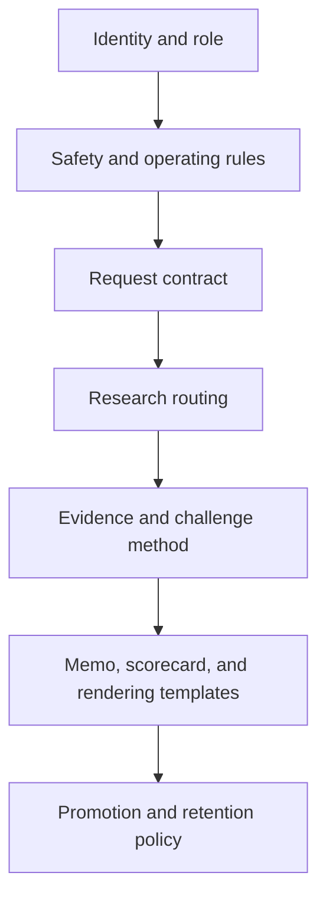
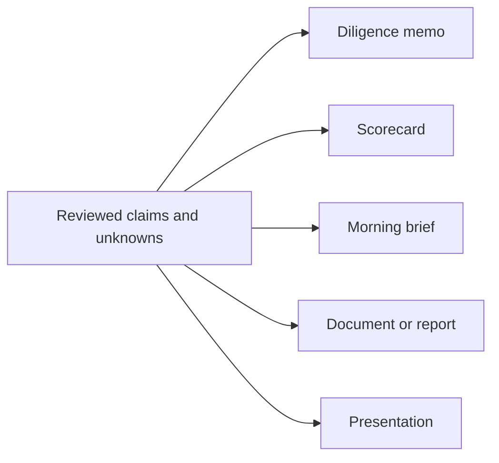

# Customizing EIR

EIR is designed to be adapted, but its evidence contract should remain stable. Change the voice, domain lens, templates, routing, or output formats without blurring founder input, verified facts, inference, and unknowns.

Start changes in a branch or copy. Treat files under `examples/` as reference artifacts, not templates to overwrite.

## Customization layers

Work from the top down. A lower layer should not quietly contradict the layers above it.

| Goal | Primary customization point | Keep invariant |
|---|---|---|
| Change tone or decision posture | [SOUL.md](../SOUL.md) | Candor about uncertainty and evidence |
| Change role or required workflow | [AGENTS.md](../AGENTS.md) | Safety, provenance, challenge pass, calibrated verdict |
| Change tool or file rules | [TOOLS.md](../TOOLS.md) | Secrets, current-fact verification, untrusted-input handling |
| Add operator preferences | [USER.md](../USER.md) | Do not publish personal or confidential details |
| Change memo structure | Copy the [diligence template](../templates/startup-diligence-memo.md) | Claim labels, sources, risks, unknowns, next experiments |
| Change executive handoff | Copy the [morning-brief template](../templates/morning-brief-startup-handoff.txt) | Verdict, confidence, decision-changing gaps |
| Add live research | Your external adapter | Opened sources, dates, claim grounding, failure visibility |
| Change promotion rules | Your library workflow | Human review and reusable, non-sensitive evidence only |

## Recipe 1: adapt the voice without changing the judgment

Edit [SOUL.md](../SOUL.md) when you want a different communication style—for example, more technical, more concise, or more founder-coaching oriented. Keep [AGENTS.md](../AGENTS.md) focused on required behavior rather than prose style.

A safe voice change says, “Use shorter sentences and put the verdict first.” An unsafe change says, “Always make the opportunity sound compelling.” The first changes presentation; the second corrupts judgment.

## Recipe 2: specialize for a vertical

Create a new copy of the diligence template and add domain-specific questions after the core decision spine. Examples:

- healthcare: clinical workflow, reimbursement, evidence, privacy, and regulatory pathway;
- climate or industrial: physical constraints, permitting, deployment, maintenance, and project finance;
- enterprise software: buying center, security review, implementation labor, switching costs, and expansion path;
- hardware: bill of materials, supply chain, certification, installation, service burden, and utilization.

Keep professional boundaries explicit. A vertical template can identify legal, medical, tax, safety, or regulatory questions; it should not claim professional certainty without qualified review.

The [micro-USV diligence memo](../examples/diligence/2026-05-26_micro-ai-unmanned-surface-vessel-diligence-memo.md) illustrates how a broad hardware concept can be narrowed to specific mission wedges. The [school-security competitor analysis](../examples/research/ai-school-security/2026-04-06-ai-school-security-competitor-analysis.md) shows a research-heavy landscape in a sensitive domain.

## Recipe 3: define a reusable request shape

Your intake should capture:

- the decision to make;
- the user-provided facts;
- the target customer and geography;
- the freshness boundary;
- the source and citation standard;
- constraints, exclusions, and safety considerations;
- the desired artifact;
- the questions most likely to reverse the verdict.

Use the [aquatic-vegetation request](../examples/projects/aquatic-vegetation/request.json) as a rich example, then remove provider-specific fields that your runtime does not support. Do not copy its historical tool list and assume those services exist here.

## Recipe 4: add a research lane

Implement new live-research behavior in your own runner, not by implying that this repository bundles it. Define:

1. when the lane is selected;
2. the evidence types it accepts;
3. the freshness and source-opening rules;
4. its maximum scope and stopping conditions;
5. how it reports failed access, contradictions, and unknowns;
6. the structured fields it returns to EIR.

For example, a patent lane might return relevant families, jurisdictions, status dates, and claim-scope caveats. It should not turn keyword similarity into a freedom-to-operate opinion.

The original environment used CX Research for broad current intelligence and R Paper for paper-forward work. Neither runner is bundled, so new integrations should follow the interface guidance in [Agent runtime](AGENT_RUNTIME.md) rather than depending on historical local paths.

## Recipe 5: create another output format

Map a reviewed evidence model into the new format instead of researching separately for every deliverable.

Every compressed format should preserve the verdict, confidence, material risks, and decision-changing unknowns. A deck may simplify prose; it must not upgrade an assumption into a fact.

Useful format references include the [DenialPilot morning brief](../examples/briefs/2026-03-10_denialpilot-morning-brief.txt), [aquatic-vegetation scorecard](../examples/projects/aquatic-vegetation/go-no-go-scorecard.json), and [HarborScout contact sheet](../examples/presentations/harborscout/source/qa/contact-sheet.png).

## Recipe 6: strengthen the promotion gate

Do not reuse the historical rule “depth standard met, therefore promote.” The preserved manifests show that source counts and automated classifications could pass even when capture success or topical relevance was weak.

Require a human reviewer to answer yes to all of these:

- Does each promoted item support a reusable claim or method?
- Was the source opened, and does it support the exact wording?
- Are publication and access dates recorded where needed?
- Are important contradictions resolved or retained as explicit unknowns?
- Is the evidence independent enough to avoid domain or article-family duplication?
- Is the item free of secrets, private customer information, and confidential founder material?
- Is reuse consistent with copyright and license terms?
- Is the learning still useful outside the original case?

If any answer is no, keep the material with the case. A “hold” decision is healthy knowledge hygiene, not a failed research run.

## Preserve the evidence contract

Every customization should keep these boundaries visible:

| Boundary | Required behavior |
|---|---|
| Input vs evidence | Founder statements remain `user-provided` until independently verified |
| Fact vs reasoning | `confirmed` and `inferred` claims are labeled separately |
| Missing vs negative | Lack of evidence becomes `unknown`, not proof of absence |
| Discovery vs confirmation | Search snippets lead to sources; they do not confirm claims |
| Old vs current | Time-sensitive facts carry dates and are refreshed before decisions |
| Coverage vs quality | Source counts are diagnostics, not proof of relevance or correctness |
| Analysis vs authority | EIR supports judgment but does not replace qualified professional review |

## Validate a customization

Use a fictional or non-sensitive case first. [DenialPilot](../examples/diligence/2026-03-10_denialpilot-diligence-memo.md) is suitable because it is explicitly presented as a fictional worked example.

Check that the customized factory:

1. retains the original user input without converting it into fact;
2. produces the full decision spine or a documented equivalent;
3. cites opened sources for material current claims;
4. exposes at least one meaningful contradiction or disconfirming search result;
5. lowers confidence when evidence is missing;
6. ends with measurable experiments and stop conditions;
7. keeps working material, shareable output, library knowledge, and memory separate;
8. produces no secrets or private data in committed files;
9. renders any HTML, PDF, DOCX, or PPTX output correctly;
10. requires human review before promotion or publication.

## Contributing a customization

When proposing a reusable change, explain the decision problem it solves, show a sanitized example, document any new dependency, and state how evidence and privacy were verified. Avoid checking in provider credentials, downloaded third-party content, private captures, generated caches, or local absolute paths.

For the end-to-end system, return to [How it works](HOW_IT_WORKS.md). For the research rules that customizations must preserve, see [Research method](RESEARCH_METHOD.md).
