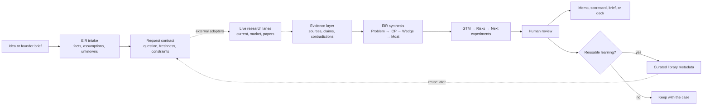
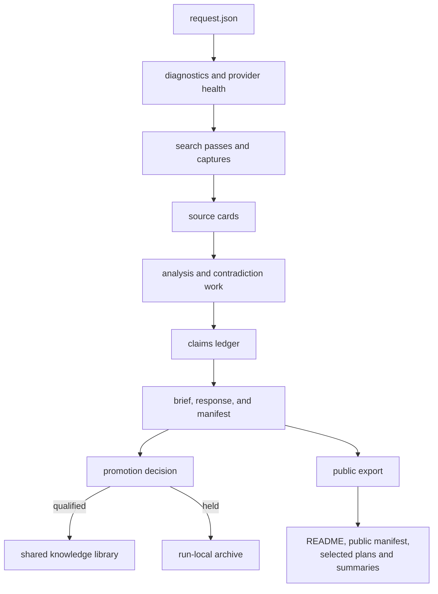

# How the EIR factory works

EIR turns an early startup idea into a decision-ready package. It does this by keeping founder input, external evidence, analysis, and judgment separate until the final synthesis.

> This repository is a public, artifact-first release of the factory. It includes the EIR operating contract, templates, selected examples, sanitized research-run metadata, and a metadata-only source library. The original CX Research and R Paper runners, search-provider adapters, private captures, and private workspace state are **not bundled**.

## The factory at a glance

The diagram below shows the complete workflow used by the original environment. Dashed lines mark capabilities that must be supplied by your own research runner.



You can still use EIR without automation: complete the templates, conduct research with tools you trust, label every claim, and use the EIR contract to challenge and synthesize the result.

## What is in this repository

| Layer | Purpose | Start here |
|---|---|---|
| Agent contract | Defines EIR's role, evidence rules, answer structure, and file behavior | [AGENTS.md](../AGENTS.md), [SOUL.md](../SOUL.md), [TOOLS.md](../TOOLS.md) |
| Templates | Repeatable forms for diligence and handoff | [Startup diligence memo](../templates/startup-diligence-memo.md), [morning brief](../templates/morning-brief-startup-handoff.txt) |
| Worked examples | Shows how the same decision method appears in different formats | [DenialPilot memo](../examples/diligence/2026-03-10_denialpilot-diligence-memo.md), [aquatic-vegetation scorecard](../examples/projects/aquatic-vegetation/go-no-go-scorecard.json) |
| Research provenance | Sanitized routes, coverage counts, plans, and run outcomes | [Historical research runs](../research-runs/README.md) |
| Reusable source metadata | URLs, source classes, scores, and originating manifests; no copied page bodies | [Source catalog](../library/SOURCE_CATALOG.md) |
| Generated artifacts | Examples of reports, documents, and presentations | [School-security research](../examples/research/ai-school-security/2026-04-06-ai-school-security-startup-diligence.md), [HarborScout deck](../examples/presentations/harborscout/harborscout-ai-yc-investor-pitch-deck.pdf) |

The repository does not contain a universal research command, provider credentials, or the private services named in historical manifests. See [Agent runtime](AGENT_RUNTIME.md) for supported ways to connect your own execution environment.

## The eight stages

### 1. Intake: preserve the original claim

Record what the founder or requester actually said before researching it. Treat those statements as `user-provided`, not confirmed. Capture the target customer, pain, proposed product, geography, constraints, and desired decision.

The public [aquatic-vegetation request](../examples/projects/aquatic-vegetation/request.json) is a detailed example of a structured intake. It includes a question, goal, freshness requirement, output format, constraints, founder-supplied facts, and tool preferences.

### 2. Frame: turn the idea into testable questions

EIR restates the idea through its decision spine:

```text
Problem → ICP → Wedge → Moat → GTM → Risks → Next experiments
```

The goal is not to make the idea sound complete. It is to expose what must be true: who experiences the pain, who pays, why the initial wedge is narrow enough to win, and which unknown could reverse the verdict.

### 3. Route: choose the evidence needed

A research plan can combine several lanes:

- current intelligence for changing facts such as regulation, pricing, products, and funding;
- market and competitor research for alternatives, positioning, customers, and distribution;
- paper-forward research for scientific or technical feasibility;
- a skeptic pass for contradictions, failure modes, and missing evidence.

In the original environment, CX Research and R Paper handled these lanes and could delegate to logical scout, analyst, and skeptic roles. Those runners are external to this public repository. The method and historical routing records remain available in [Research method](RESEARCH_METHOD.md).

### 4. Gather: create an evidence trail

The historical system recorded search passes, opened pages, source cards, access dates, and coverage metrics. Material claims were supposed to point back to relevant sources, with primary and authoritative sources preferred.

Search results are leads, not evidence. A snippet, domain name, or automated quality score is never enough by itself to confirm a claim.

### 5. Analyze: separate claim types

EIR uses four practical labels:

- `user-provided`: supplied by the requester and not independently verified;
- `confirmed`: supported by an opened, relevant source;
- `inferred`: a reasoned conclusion based on named evidence;
- `unknown`: missing evidence that may change the decision.

Historical artifacts sometimes call the last category `open_questions`. The meaning is the same: do not quietly fill the gap with confident prose.

### 6. Challenge: try to break the thesis

Before writing the verdict, look for evidence against the attractive story. Test regulatory blockers, incumbent responses, adoption friction, service labor hidden inside software margins, weak willingness to pay, technical dependencies, and distribution assumptions.

Contradictions should be shown, not averaged away. If two credible sources disagree, retain both positions, explain the likely reason, and lower confidence until the conflict is resolved.

### 7. Decide: make the judgment falsifiable

The standard verdict is `Invest`, `Watch`, or `Pass`, paired with a confidence level. The memo should explain what supports the decision, what could overturn it, and why the current evidence is sufficient—or insufficient—to proceed.

The last section is action, not ceremony: name the cheapest decisive experiments, an owner, a measurable success threshold, and a stop condition. The [DenialPilot memo](../examples/diligence/2026-03-10_denialpilot-diligence-memo.md) is the clearest compact example of this structure.

### 8. Promote: retain only reusable learning

Case-specific notes should remain with the case. Durable source metadata, reusable market patterns, or stable decision rules may be promoted to the library after review.

Promotion is a knowledge-management action, not an endorsement of the startup and not proof that every source or claim is correct.

## Historical artifact lifecycle

The original private runner used a richer run directory than the public export preserves:



Raw captures, provider payloads, private source cards, long excerpts, logs, and private memory were intentionally excluded from this release. The files under [research-runs](../research-runs/README.md) are therefore provenance summaries, not reproducible evidence bundles.

## Why a historical `promoted` label is not a truth stamp

Some historical promotion decisions were driven mainly by numeric floors such as pass count, source count, and automated source-quality classifications. Those gates were useful for detecting obviously shallow runs, but they were imperfect:

- one focused architecture run recorded 25 capture attempts, promoted zero captures, and was still promoted because its depth and source-count thresholds passed;
- another architecture chain stopped early because its next branch scored poorly, leaving coverage fields unknown;
- concentrating results on an official domain could increase a “primary-like” count while still producing off-topic or weakly useful sources;
- source quantity, domain authority, and search depth do not prove claim-level relevance or correctness.

Treat `promotion.status: promoted` in a historical manifest as “the old workflow gate passed,” not “a human verified every claim.” Before reusing a record, open the source, check that it supports the exact claim, confirm freshness, resolve contradictions, and apply human judgment. [Research method](RESEARCH_METHOD.md) defines the stronger gate recommended for new work.

## A useful tour of the examples

1. Read the fictional [DenialPilot diligence memo](../examples/diligence/2026-03-10_denialpilot-diligence-memo.md) to learn the decision structure without relying on a real company's claims.
2. Compare it with the [morning brief](../examples/briefs/2026-03-10_denialpilot-morning-brief.txt) to see how a long analysis becomes an executive handoff.
3. Inspect the [aquatic-vegetation request](../examples/projects/aquatic-vegetation/request.json) and [scorecard](../examples/projects/aquatic-vegetation/go-no-go-scorecard.json) to see structured inputs and a machine-readable decision artifact.
4. Browse [historical research runs](../research-runs/README.md) to understand routing and coverage—and to study failure modes, not just successes.
5. Open the [HarborScout deck](../examples/presentations/harborscout/harborscout-ai-yc-investor-pitch-deck.pdf) and its [contact sheet](../examples/presentations/harborscout/source/qa/contact-sheet.png) to see one presentation output and its visual QA artifact.

## Continue reading

- [Research method](RESEARCH_METHOD.md): request design, evidence labels, contradiction handling, and quality gates.
- [Agent runtime](AGENT_RUNTIME.md): what the repository can run by itself and what your environment must provide.
- [Customization](CUSTOMIZATION.md): how to adapt the factory without weakening its evidence contract.
