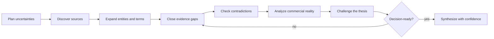

# Research and evidence method

EIR research exists to improve a decision, not to maximize the number of links in a report. A good run makes it easy to distinguish what was supplied, what was observed, what was inferred, and what remains unknown.

This guide describes both the intended method and the limitations visible in the preserved historical artifacts. The original CX Research and R Paper runners are not included in this repository, so use the method with your own browsing, retrieval, citation, and orchestration tools.

## Operating principles

1. **Preserve provenance.** Keep founder input separate from externally verified facts.
2. **Research to a decision.** Every search lane should close a named uncertainty or challenge an assumption.
3. **Prefer primary evidence.** Use regulators, filings, standards, official product documentation, original datasets, and research papers when they directly answer the question.
4. **Open the source.** Search snippets and generated summaries are discovery aids, not confirmation.
5. **Date changing facts.** Funding, pricing, law, product capability, competitors, and market activity can become stale quickly.
6. **Keep dissent visible.** Record conflicting evidence and reduce confidence until it is resolved.
7. **Stop when the decision is informed.** More pages are not necessarily more diligence.

## 1. Write a request contract

A strong research request is explicit enough that another researcher can understand the decision, time boundary, evidence standard, and stopping condition.

| Field | What it controls |
|---|---|
| `question` | The precise problem to investigate |
| `goal` | The decision or deliverable the research must support |
| `freshness` | The date boundary and which claims require current verification |
| `must_cite` | Whether material findings require source-level support |
| `max_depth` | Expected breadth, iteration, and challenge effort |
| `output_format` | Memo, scorecard, market map, report, or another artifact |
| `constraints` | Preferred source types, exclusions, safety rules, and known limitations |
| `context.user_provided_facts` | Claims supplied by the requester, retained as unverified inputs |
| `tool_controls` | Required, preferred, or forbidden tools for the external runner |
| chain settings | Whether the runner may branch across subquestions and when it must stop |

See the [aquatic-vegetation request](../examples/projects/aquatic-vegetation/request.json) for a detailed historical example. Tool names in that file describe its original environment; they are not dependencies provided by this repository.

Before launching research, rewrite broad prompts into decision-changing questions. “Research this market” is weak. “Can a two-person team legally deliver a recurring shoreline-removal service in Austin at a gross margin worth testing, and which evidence would falsify that thesis?” is actionable.

## 2. Route the work by evidence type

| Lane | Best for | Typical primary sources |
|---|---|---|
| Current intelligence | Regulation, funding, current products, pricing, procurement, recent events | Regulators, filings, official notices, product pages, press rooms |
| Market and competitors | Alternatives, customers, positioning, channels, commercial signals | Company documentation, customer materials, public contracts, filings |
| Paper-forward | Scientific feasibility, technical performance, safety, established methods | Peer-reviewed papers, preprints with caveats, standards, technical reports |
| Skeptic and contradiction | Disconfirming evidence, hidden constraints, thesis failure modes | Counterexamples, enforcement actions, negative studies, customer objections |

The same source can serve more than one lane, but its authority is claim-specific. A company page is primary evidence for what the company says it offers; it is not independent proof that the product works or customers are satisfied.

## 3. Run iterative passes

The historical deep-research profiles named six required checks: discovery, expansion, gap closing, contradiction checking, commercial analysis, and a challenge pass. A maintainable version looks like this:



Each additional pass should have a reason. Record the gap it targets, the query or source class used, and whether it changed the conclusion. Stop when remaining gaps are explicit and further retrieval is unlikely to change the next action.

## 4. Build claim-level evidence

Use four labels consistently:

| Label | Meaning | Minimum handling |
|---|---|---|
| `user-provided` | Supplied by the founder or requester | Preserve attribution; do not cite as independent proof |
| `confirmed` | Supported by an opened, relevant source | Cite precisely and include the access or publication date |
| `inferred` | A conclusion drawn from named evidence | Show the reasoning and avoid false precision |
| `unknown` | Evidence is missing, conflicting, or too weak | State what would resolve it and why it matters |

Historical runs may use `open_questions` instead of `unknown`. Do not promote an inference to confirmed merely because several search results repeat it; repeated claims may all trace back to the same weak source.

The original private workflow created source cards and a claims ledger. Those private cards and raw page captures are not in this public export. Public manifests can tell you how a run was routed and counted, but they cannot independently prove a report's claims.

## 5. Judge source quality at the claim level

A practical source ladder is:

1. primary authority directly responsible for the fact;
2. original research, dataset, filing, standard, or official technical document;
3. high-quality secondary analysis with transparent sourcing;
4. first-party marketing, useful for product claims but not independent validation;
5. aggregators, community discussion, and search snippets, useful mainly for discovery.

Do not turn this ladder into a mechanical domain score. Test every source against five questions:

- Is it topically relevant to this exact claim?
- Is it the original source or merely repeating another source?
- Is the publication or access date appropriate for the claim?
- Does the page actually support the wording and precision used?
- Is there a financial, promotional, political, or methodological conflict to disclose?

## 6. Preserve contradictions

For material disagreements, keep a compact contradiction record:

| Field | Purpose |
|---|---|
| Claim under test | The exact disputed statement |
| Supporting evidence | Source, date, and relevant scope |
| Conflicting evidence | Source, date, and relevant scope |
| Likely explanation | Geography, time, sample, definition, incentive, or method difference |
| Decision effect | Whether the disagreement changes the verdict or confidence |
| Resolution step | Interview, primary document, experiment, or later update needed |

A contradiction is not a formatting problem. If it affects legality, willingness to pay, technical feasibility, or unit economics, it should be visible next to the verdict.

## 7. Apply a real quality gate

The historical system often used automated coverage floors—passes, unique sources, “meaningful” sources, “high-quality” sources, and “primary-like” sources—to decide whether a run could be promoted. These were useful process signals, but they were not sufficient evidence-quality gates.

The public records show why:

- the [focused architecture run](../research-runs/2026-07-04_deep-market-and-competitor-diligence-on-ai-architecture-and-a-df162aec3a--07-04/manifest.public.json) passed its depth standard and promoted 33 cards even though it promoted no captures after 25 recorded capture attempts;
- the [broader architecture chain](../research-runs/2026-07-04_deep-current-diligence-on-a-startup-concept-an-ai-native-plat-aac44e67b7--07-04/README.md) stopped after a weak next branch and left core coverage fields unknown;
- official-domain concentration and automatic classifications could make source counts look strong while allowing off-topic material into the [source catalog](../library/SOURCE_CATALOG.md);
- a source-count floor cannot detect whether the final prose is actually grounded in the cited pages.

For new work, require all of the following before promoting learning beyond a case:

- **Topical relevance:** every promoted source materially supports the named question or reusable pattern.
- **Claim grounding:** every consequential confirmed claim points to an opened source that supports its exact wording.
- **Freshness:** changing facts have an explicit research date and are current enough for the decision.
- **Capture or access integrity:** key sources were successfully opened; failed access is recorded as a gap, not silently counted as evidence.
- **Contradiction resolution:** material disagreements are resolved or carried forward as explicit unknowns.
- **Source diversity:** no single domain or repeated article family creates a false impression of corroboration.
- **Human approval:** a reviewer confirms usefulness, privacy, licensing, and evidence quality.

Historical `promoted` therefore means “the historical automated threshold passed.” It does **not** mean “human-verified truth,” “investment-ready,” or “safe to reuse without checking.”

## 8. Synthesize for a decision

Research should feed the EIR answer spine:

```text
Problem → ICP → Wedge → Moat → GTM → Risks → Next experiments
```

End with:

- an `Invest`, `Watch`, or `Pass` view;
- a calibrated confidence level;
- the strongest supporting and disconfirming evidence;
- unknowns that could reverse the decision;
- the smallest experiments that resolve those unknowns;
- success metrics and stop conditions.

The [startup diligence template](../templates/startup-diligence-memo.md) provides a full structure. The [DenialPilot example](../examples/diligence/2026-03-10_denialpilot-diligence-memo.md) shows a compact, fictional application.

## Reading the historical runs responsibly

Start with the [research-run index](../research-runs/README.md). Within each run:

- `README.md` summarizes the question, route, and reported coverage;
- `manifest.public.json` preserves machine-readable routing and metrics;
- `deep_plan.md`, when present, shows the intended branches;
- `deep_activity_summary.md`, when present, describes execution at a high level.

These files do not include the raw evidence required to reproduce the run. Re-open original links through the [source catalog](../library/SOURCE_CATALOG.md), verify the relevant page, and repeat time-sensitive research before using an old conclusion.

## When to refresh research

Always refresh claims involving current law, regulation, prices, funding, leadership, product capabilities, availability, competitors, market activity, or safety guidance. Refresh older technical evidence when methods, standards, or the intended application have changed.

Record the new research date and preserve the old conclusion if comparison is useful. Do not overwrite history in a way that makes a past decision look as if it used evidence that did not yet exist.

## Method boundary

EIR improves the structure and auditability of startup judgment. It does not replace customer interviews, technical validation, licensed professional review, legal analysis, or investment diligence. In regulated or high-stakes settings, treat the output as a research aid and obtain qualified review.
